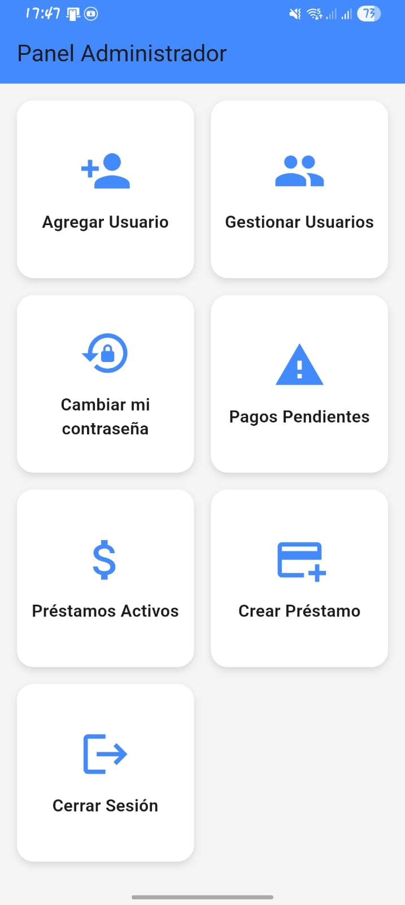
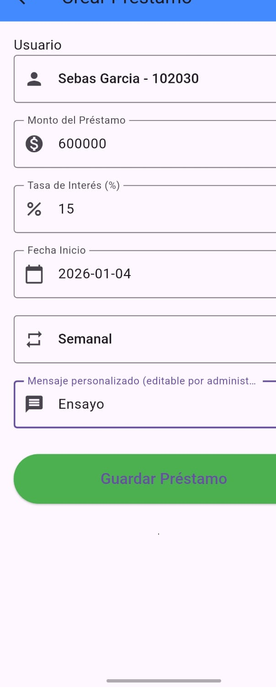
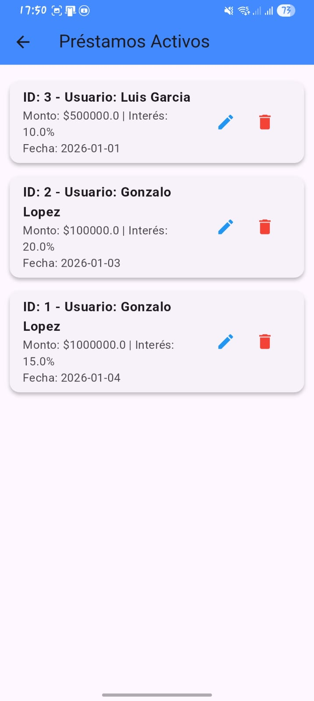
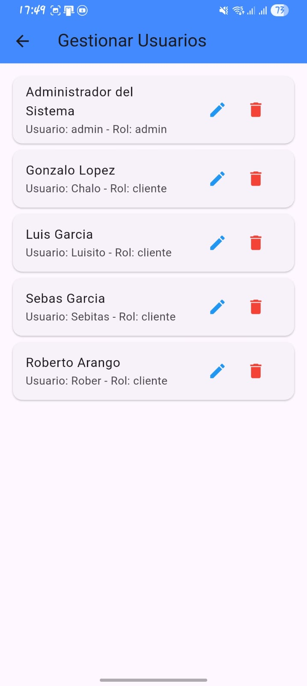
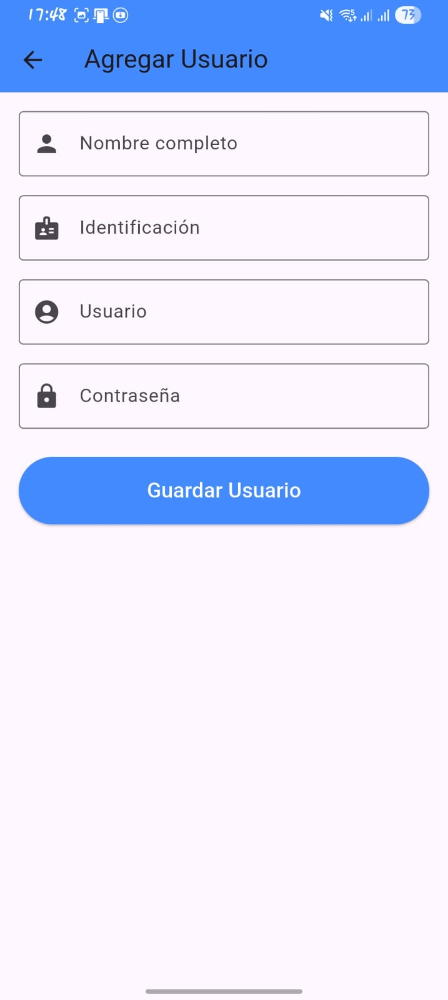

# 1 Proyecto Flutter - Natillera Digital Tejadas

Aplicación movil modular para la gestión de préstamos y pagos, con recordatorios automaticos.

## Características principales

- Gestión de Usuarios: Registro, inicio de sesión y administración de perfiles para administradores y clientes.
- Prestamos activos: Visualización y gestión de préstamos activos, con detalles completos.
- Pagos pendientes: Seguimiento de pagos pendientes y notificaciones automáticas para los clientes.
- Creación de préstamos: Formularios intuitivos para crear y asignar préstamos a los usuarios.
- Dashboard admin y cliente: Interfaces diferentes segun el rol.
- 
## ESTRUCTURA DEL PROYECTO 

 lib/
    ├── models/                  # Modelos de datos 
        auth_user.dart
        historial_model.dart
        loan_model.dart
        pago_model.dart
        prestamo_model.dart
        user_model.dart
    ├── screens/                 # Pantallas de la aplicación
        admin/
            loans/
                add_loan.dart
                admin_loans_list.dart
                loan_create_screen.dart
                loan_detail_screen.dart
                loan_form_screen.dart
                loan_notification_controller.dart
                loan_notification_service.dart
                loans_list_screen.dart
                pagos_pendientes_screen.dart
            reportes/
                reportes_financieros_screen.dart
            usuarios/
                user_detail_screen.dart
                user_edit_screen.dart
                user_list_screen.dart
                user_loans_screen.dart
            dashboard_admin.dart
            add_user.dart
            gestionar_usuarios_screen.dart
            prestamos_activos_screen.dart
            cerrar_sesion.dart
            login_admin.dart
        cliente/
            cliente_cuentas_screen.dart
            cliente_password_screen.dart
            cliente_profile_screen.dart
            dashboard_cliente.dart
        cambiar_password_screen.dart
        login_screen.dart
    services/                # Lógica de negocio y servicios
        auth_service.dart
        loan_service.dart
        database_helper.dart
        notification_service.dart
        user_service.dart
        pago_data.dart
        prestamo_data.dart
        session.dart
        user_data.dart
        
    ├── widgets/                 # Componentes reutilizables de UI
    main.dart                    # Punto de entrada de la aplicación

## Instalación y configuración
### Requisitos previos
- Flutter 3.x o superior
- Dart 2.x o superior
- Android SDK configurado

### Pasos de instalación
''' bash
# Clonar el repositorio
git clone  https://github.com/ChaloBuitrago/App_Sebas.git

# Instalar dependencias
flutter pub get

# Ejecutar la aplicación
flutter run

## Dependencias principales 
- flutter sdk Framework para desarrollo de la app 
- flutter_local_notifications: 17.2.1  // Manejo de notificaciones locales(recordatorios)
- timezone: 0.9.0 // Manejo de zonas horarias para notificaciones
- permission_handler: 11.3.2 // Solicitud y la gestión de los permisos del dispositivo
- flutter_localizations: SDK // Soporte multiidioma y localización en la app
- sqflite: 2.2.8+4 // Base de datos SQLite para persistencia local de datos(prestamos,pagos,usuarios)
- path_provider: 2.0.15 // Acceso a directorios del sistema de archivos para almacenamiento local
- path: 1.8.4 // Manipulación de rutas de archivos y directorios
- cupertino_icons: 1.0.8 // Iconos estilo iOS para la interfaz de usuario
- hive: 2.2.3 // Base de datos NoSQL ligera para almacenamiento rapido 
- hive_flutter: 1.1.0 // Integración de Hive con Flutter para almacenamiento local rapido

## Dependencias de desarrollo
- flutter_test: SDK // Framework de pruebas unitarias e integración}
- flutter_lints: 2.0.0 // Reglas de estilo y buenas prácticas para el código Flutter

## Flujos principales 

### Admin 
- Registro e inicio de sesión > acceso a dashboard
- Crear usuario > guardar en base de datos
- Asignar Prestamo > relación entre usuario y prestamo
- Ver Pagos Pendientes > cuotas próximas o vencidas
- Prestamos Activos > ver lista de prestamos en curso
- Notificaciones > recordatorios automaticos a usuarios
- Reportes y Estadísticas > generar reportes financieros  //pendiente aun hoy 03/01/2025

### Cliente
- Registro e inicio de sesión > acceso a Cliente Home
- Ver Prestamos > lista de prestamos asignados
- Ver Cuotas > detalle de cuotas pendientes y pagadas
- Ver Notificaiones > alertas de pagos proximos o pendientes
- Historial de Pagos > registro de pagos realizados
- Perfil de Usuario > ver y editar informacion personal(incluyendo contraseña)
- Contacto y Soporte > canal de comunicación con admin. //pendiente para crear

##Pantallas 

### Admin 
- 'dashboard_admin.dart' > vista principal luego de iniciar sesión
- ''

### Dashboard Admin 
- Agregar Usuario > /addUser > 'add_user.dart'
- Gestionar Usuario > /gestionarUsuarios > gestionar_usuarios_screen.dart
- Cambiar Contraseña → /cambiarPassword > 'cambiar_password_screen.dart'
- Pagos Pendientes → /pagosPendientes > 'pagos_pendientes_screen.dart'
- Préstamos Activos → /prestamosActivos > 'prestamos_activos_screen.dart'
- Crear Préstamo → /crearPrestamo > 'loan_create_screen.dart'
- Reportes Financieros → /reportesFinancieros > 'reportes_financieros_screen.dart'
- Cerrar Sesión → /cerrarSesion > 'cerrar_sesion.dart'

## Diagrama de relaciones

El sistema se organiza en tres tablas principales:

- Usuarios: Información de los clientes.
- Loans: Prestamos asociados a cada usuario.
- Prestamos: pagos/cuotas asociadas a cada préstamo.

### Entidad-Relación

Tablas Principales 
- Usuarios (User)
    - id (PK)
    - nombre
    - email
    - phone
    - status
    - password
    - role (admin/cliente)
    - createdAt
- Loans (Prestamo)
    - id (PK)
    - userId (FK a Usuarios.id)
    - amount (monto del préstamo)
    - interest (tasa de interés)
    - startDate (fecha de inicio del préstamo)
    - status (estado del prestamo: activo, cerrado)
    - periodicidad (diario, semanal, mensual)
    - customMessage (mensaje personalizado para recordatorios)
    - notes (notas adicionales)
    - createdAt
- Prestamos 
    - id (PK)
    - userId
    - monto
    - fechaInicio
    - periodicidad
    - tasa
    - createdAt

## Capturas de pantalla

### Dashboard Admin

### Crear Préstamo

### Préstamos Activos

### Gestionar Usuarios

### Agregar Usuario

## 🛣️ Roadmap

- [x] Corrección de errores en pantallas de Pagos Pendientes y Préstamos Activos
- [ ] Corrección de errores en cambiar contraseña en el panel administrador
- [ ] Crear los botones iniciales que tendrá la interfaz de cliente
- [ ] Organizar lo titulos de los ultimos dos items del formulario crear préstamo
- [ ] Conectar la base de datos para que el cliente ya pueda ingresar a ver su información luego de ser creado por el admin
- [ ] Canal de soporte cliente (chat o tickets) // pendiente
- [ ] Exportación de reportes en PDF/Excel // funcionalidad pendiente($$$)
- [ ] Multi-idioma (es/en) // pendiente a negociar 
- [ ] Optimización de tiempos de carga //Hacer si o si antes de lanzar la app
- [ ] Pruebas unitarias e integración //importante antes de lanzar la app
- [ ] Integración con servicios en la nube //Proximos
- [ ] Módulo de pagos en línea // Negociable $$$

# src

Aplicacion para llevar las cuentas de natilleras, pretamistas o pagadiarios

## Getting Started

This project is a starting point for a Flutter application.

A few resources to get you started if this is your first Flutter project:

- [Lab: Write your first Flutter app](https://docs.flutter.dev/get-started/codelab)
- [Cookbook: Useful Flutter samples](https://docs.flutter.dev/cookbook)

For help getting started with Flutter development, view the
[online documentation](https://docs.flutter.dev/), which offers tutorials,
samples, guidance on mobile development, and a full API reference.
